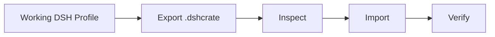

<div align="center">

# DSH Crate

**Share a complete DeepSeek Harness setup as one inspectable file.**

[](#current-preview)
[](#license)
[](https://github.com/deepseek-ai/deepseek-harness)

[Quick Start](#quick-start) · [How It Works](#how-it-works) · [Community Crates](#community-crates) · [简体中文](README.zh-CN.md)

</div>

DSH Crate turns a configured DeepSeek Harness Profile into a portable `.dshcrate` you can **inspect before Import, reconstruct as another Profile, and verify afterward**.

Instead of sending someone a plugin list, version notes, Bundle instructions, and configuration steps, send one Crate.



## Highlights

- **Share complete setups** — package a working DSH Profile into one `.dshcrate`.
- **Inspect before importing** — review plugins, environment differences, and risks before anything changes.
- **Portable plugin sources** — embed installable artifacts where appropriate, or keep plugins `reference-only`.
- **Safe by default** — Secret values stay out, Inspect is read-only, and existing Profiles are never silently overwritten.
- **Verify after Import** — check the reconstructed Profile and keep structured diagnostics when something fails.

## Quick Start

Install the Web plugin into your DSH Web Profile:

```bash
dsh plugin --profile web add dsh-crate-web
```

Restart DSH Web, then open:

```text
Settings → DSH Crate
```

DSH Crate is an extension for DeepSeek Harness. It does **not** install or replace the DSH runtime; the target machine must already have a working DSH installation.

## How It Works

### 1. Export

Pick a configured Profile and export it as a `.dshcrate`.

A Crate can carry:

- Profile metadata
- installed plugin identity and sources
- Bundles
- required Secret names
- environment information
- embedded plugin artifacts where appropriate

Secret **values** are excluded.

### 2. Inspect

Before Import, DSH Crate runs Preflight and reports:

- **BLOCKER** — Import should not continue
- **WARNING** — Import can continue, but a known risk or difference exists
- **INFO** — useful package or environment information

You can review the target Profile, plugin operations, environment differences, and detected risks before anything is written.

### 3. Import

Import creates a **new Profile by default**.

Overwriting an existing Profile requires explicit confirmation. The current running Profile is never silently replaced.

### 4. Verify

After Import, DSH Crate can Verify the imported or prepared Profile and produce structured diagnostics.

A Verify PASS means the checks DSH Crate actually ran passed. It is **not** a blanket claim that every model, Session, Core Tool, or third-party plugin business function works.

## Current Preview

The current Preview supports:

- inspecting the current Profile, installed plugins, and Bundles
- exporting Profiles as `.dshcrate`
- choosing `embedded` or `reference-only` plugin handling
- recording required Secret names without exporting Secret values
- Inspect / Preflight with `BLOCKER`, `WARNING`, `INFO`, and environment differences
- Import Preview before changes are applied
- Import as a new Profile
- explicit-confirmation overwrite of an existing Profile
- Verify for imported or prepared Profiles
- complete failure diagnostics and copyable diagnostic JSON
- versioned diagnostic envelopes (`producer`, `crateVersion`, `diagnosticSchemaVersion`, `operation`, `operationId`, `status`) on every diagnostic
- a version-locked Troubleshooting Skill (`skills/dsh-crate-troubleshooting`) that ships with each Release and only repairs diagnostics it understands
- operation history and Crate download
- deletion of non-running Profiles
- explicit-confirmation Profile switch and restart

The current Preview does **not** directly test:

- model conversations
- Session creation
- Core Tool execution
- plugin-specific business functions

Those capabilities remain outside the current verification claim.

## Share or Migrate

### Share a setup

Without a Crate:

```text
Install plugin A
Install plugin B
Use this version
Enable these Bundles
Apply this config
Add these Secrets
...
```

With DSH Crate:

```text
Export → send setup.dshcrate → Inspect → Import
```

The recipient can see what is inside before changing their environment.

### Move to another machine

```text
Machine A
   ↓
Export
   ↓
.dshcrate
   ↓
Machine B
   ↓
Preflight
   ↓
Import
   ↓
Verify
```

The goal is not to clone the original machine byte-for-byte. The goal is to reconstruct the DSH environment from portable information and explicit package sources.

## Embedded vs Reference-only

### Embedded

The Crate carries an installable plugin artifact when available and appropriate.

Use this when preserving the actual installable artifact matters more than file size.

```text
plugin artifact
+ package identity
+ integrity information
        ↓
     .dshcrate
```

### Reference-only

The Crate stores plugin source and identity, then reacquires the plugin during Import.

Use this when:

- the source is expected to remain available
- redistribution is not appropriate
- you want a smaller Crate

A single Crate can mix both modes.

## Community Crates

A `.dshcrate` can be more than a backup artifact: it can be a reusable DSH setup.

**Useful, tested Community Crates are welcome as Pull Requests.**

Good examples include:

- Coding environments
- Research / Browser environments
- minimal practical Profiles
- specialized workflow setups
- plugin combinations that solve a real task

A Community Crate should state:

- purpose
- included plugins
- embedded / reference-only choices
- required Secret names
- tested DSH version
- tested Node version
- tested operating system
- what was actually verified
- known limitations
- last tested date

`Verified` means only that the listed checks were executed in the listed environment. It does **not** mean universal compatibility.

## Safety

DSH Crate is designed around explicit changes and inspectable artifacts:

- Secret values are excluded from ordinary Crates.
- Inspect and dry-run are read-only.
- Existing Profiles are not silently overwritten.
- Overwrite, switch, restart, and destructive Profile operations require explicit confirmation.
- Failed Import should not commit a partially successful target.
- Full diagnostics remain available after failure.

## FAQ

### Why not just zip `DSH_HOME`?

You can — and for a private backup of one machine, that may be the simplest option.

DSH Crate solves a different problem: **sharing, migration, inspection, and controlled reconstruction** without copying the entire DSH home.

A raw archive may contain or depend on credentials, private Conversations, caches, logs, temporary state, machine-specific paths, `node_modules`, and local runtime details.

DSH Crate instead separates portable environment data, reference-only dependencies, required Secret names, and excluded private/runtime data.

### What does Verify actually prove?

Only the checks DSH Crate actually ran.

A successful Profile Verify is not evidence that model conversation, Session creation, Core Tool execution, or every plugin-specific feature works unless those checks were explicitly performed.

### Is DSH Crate a Profile manager?

Profile management is not the main product.

DSH Crate focuses on **portable environment artifacts, controlled Import, migration, diagnostics, and evidence-based verification** rather than becoming a second general-purpose Profile manager.

## Roadmap

The near-term direction is intentionally narrow:

- **Troubleshooting Skill** — shipped since 0.1.1: version-locked with each Release, reads the versioned diagnostic envelope, classifies `FULL` / `COMPATIBLE` / `UNSUPPORTED`, applies L0-L3 repair boundaries, and only reports success after a real Verify.
- **Broader environment portability** — add Conversation, plugin configuration, plugin-owned workflow, and other safely identifiable plugin-local data.
- **Full Configuration Freeze** — later, preserve as much reconstructible DSH configuration as possible and report whether offline restoration is actually proven.

Freeze is an advanced workflow, not the primary reason to use DSH Crate.

## Development CLI

The Core currently exposes a development CLI:

```powershell
dsh-crate inspect .\example.dshcrate --json
dsh-crate import .\example.dshcrate --dsh-home $env:DSH_HOME --json
dsh-crate verify --dsh-home $env:DSH_HOME --profile my-profile --mode web --json
```

Use `--offline` to disable network fallback for missing reference-only plugins.

## Contributing

Useful contributions include:

- reproducible Import / Export failures
- unusual npm / Git / tarball plugin sources
- Windows / Linux / macOS test results
- third-party packaging edge cases
- documentation improvements
- useful, tested Community Crates

For bug reports, include:

```text
DSH version:
Node version:
OS / architecture:
Source Profile:
Expected behavior:
Observed behavior:
Diagnostic JSON:
```

Do not include real credentials.

## License

MIT License.
